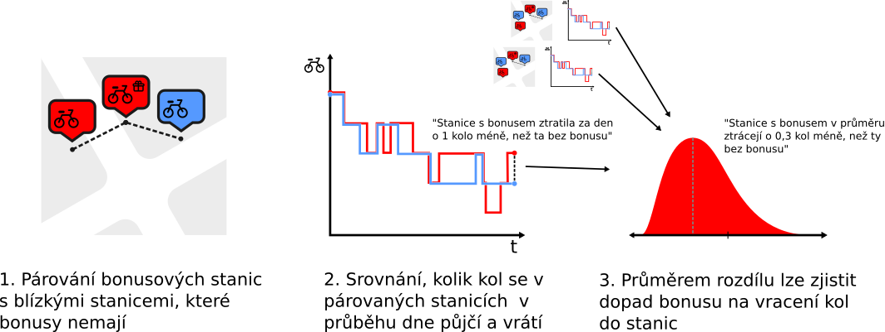

Sdílená kola se v posledních letech staly důležitou součástí multimodální dopravy v Praze. Provoz bikesharingových systémů se ale v Praze musí potýkat s členitostí terénu: vzhledem k fyzické náročnosti jízdy na kole mají sdílená kola tendenci se přesouvat z výše položených částí města do níže položených. To vede k soustavným nedostatkům kol ve vyvýšenějších čtvrtích, což omezuje využití tohoto módu přepravy. Bikesharingové firmy tento problém často řeší přesouváním kol nákladními vozidly, což je ale finančně i časově nákladné. Inovativní řešení, které v pražském kontextu uplatňuje například firma Rekola, je vytyčení bonusových stanic -- míst, kde je vrácení kola spojeno s bonusem (v případě Rekol prominutí platby za 30 minut jízdy). Výzkum má za cíl zkoumat, jak velký mají tyto bonusy dopad na dostupnost kol v cílových lokalitách. 

Mimo teoretickému pozorumnění finančním incentivům v oblasti sdílené dopravy mohou být výsledky zajímavé pro operátory sdílených vozidel pro zefektivnění jejich provozu, i pro Prahu jako informace k vylepšení systému multimodální dopravy.

Projekt je součástí atestace předmětu *Technology economics* na Institutu ekonomických studií FSV UK vedeným Brunem Baránkem, Ph. D.

# Metodologie

Výzkum se snaží kvantifikovat, *zda uživatelé bikesharingu vrací kola do bonusových stanic časteji, než kdyby tyto stanice bonus neměly*. Základní problematikou je nalezené vhodné srovnávací skupiny. Stanice s bonusem nelze přímočaře srovnt s ostatními stanicemi: bonus je přiřazován těm stanicím, které by byly pro uživatele jinak neatraktivní. Pokud prosté srovnání zjistí, že se do bonusových stanic kola vracejí méně než do nebonusových, výsledek nejspíše nereflektuje bonus samotný, ale dopad charakteristik stanic, kvůli kterým dostaly bonus. Pražský kontext ale umožňuje využít ekonometrické metody k nalezení skutečného dopadu.

Hustá síť stanic umožňuje najít mhono případů, kdy je bonusová a nebonusová stanice vzdálena jen několik desítek metrů. Takové stanice mohou být srovantelnější: mají podobné vyvýšení a nabízí přístup k podobným cílům cesty. Pokud je do bonusové stanice vráceno více kol než do nebonusové stanice vzdálené 20 metrů, vypovídá to o bonusu více, než u srovnání průměrné bonusové a průměrné nebonusové stanice. K výzkumu je také možné využít fakt, že Praha má spolupráci s dvěmi srovnatelnými spolčnostmi bikesharingu: *Rekola* i *NextBike* provozují podobné služby, bonusové stanice mají ale pouze Rekola. Je tedy možné srovnávat bonusové stanice Rekol i se stanicemi NextBike, které často bývají v totožné lokalitě.

{width=100%}

# Data

Pro provedení výzkumu je nutné několikrát za den sledovat počet kol ve stanicích bikesharingu (kola se každý den redistribuují, dynamiku půjčování je tedy potřeba sledovat v drobnější granularitě). Jedná se o data, která jsou přístupná pro veřejnost skrze aplikace poskytovatelů, a ke kterým podle našich informací úmožňuje přístup i [API Golemio](https://api.golemio.cz/docs/openapi/#/%F0%9F%9A%B2%F0%9F%9A%98%20%20Vehiclesharing%20(v2)/GETSharedVehicle), nejsou však součástí OpenDat. Takto získaná data pak lze propojit s veřejnými Geodaty pro provedení samotného výzkumu.

Vzhledem k tomu, že se na individuální stanici v průběhu dne vypůjčí a vrátí relativně omezený počet kol a že dopad bonusu může být relativně malý, je žádoucí ke každé stanici pozbírat data za delší časový úsek (typově několik týdnů). Ideální by bylo mít data o co největším počtu relevantních stanic, v případě potřeby je ale možné výzkum provést pouze vhodném vzorku. Prakticky by zpřístupnění dat mohlo znamenat buď časově (či jinak) omezený přístup k API endpointům Vehiclesharingu, popřípadě poskytnutím historických dat, pokud je GolemIO má k dispozici.

